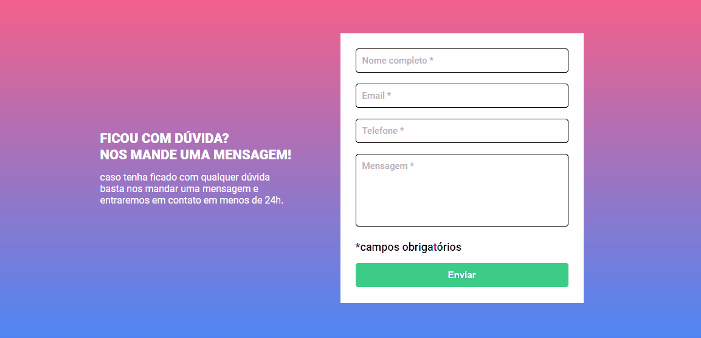

# Formulário com Validação

Este projeto consiste em um formulário web com validação em tempo real, desenvolvido para praticar HTML, CSS e JavaScript. O objetivo é garantir que os dados sejam inseridos corretamente antes do envio, fornecendo feedback imediato ao usuário sobre os campos obrigatórios e as regras de validação.



## Tecnologias Utilizadas

- **HTML**
- **CSS**
- **JavaScript**
- **Figma**

## Funcionalidades

- Validação de campos obrigatórios
- Feedback visual para o usuário
- Prevenção de envio de formulário sem preenchimento adequado

## Como Usar

1. Clone o repositório:

   ```bash
   git clone https://github.com/Alberesbass/formulario-com-validacao.git
   ```

2. Abra o arquivo `index.html` no seu navegador para testar o formulário com validação.

## Estrutura de Pastas

```
📦 formulario-com-validacao
 ┣ 📂 src
 ┃ ┣ 📂 css
 ┃ ┃ ┣ 📜 reset.css
 ┃ ┃ ┣ 📜 responsivo.css
 ┃ ┃ ┣ 📜 style.css
 ┃ ┃ ┗ 📜 variables.css
 ┃ ┣ 📂  
 ┃ ┃ ┗ 🖼️ bg-repeat.jpg
 ┃ ┣ 📂 js
 ┃ ┃ ┗ 📜 script.js
 ┣ 📜 index.html
 ┣ 📜 README.md
 ┗ 🖼️ preview-projeto.gif
```

## Licença

Este projeto está sob a licença MIT. Consulte o arquivo [LICENSE](./LICENSE) para mais informações.

---

Desenvolvido por [Alberes](https://github.com/Alberesbass)

---